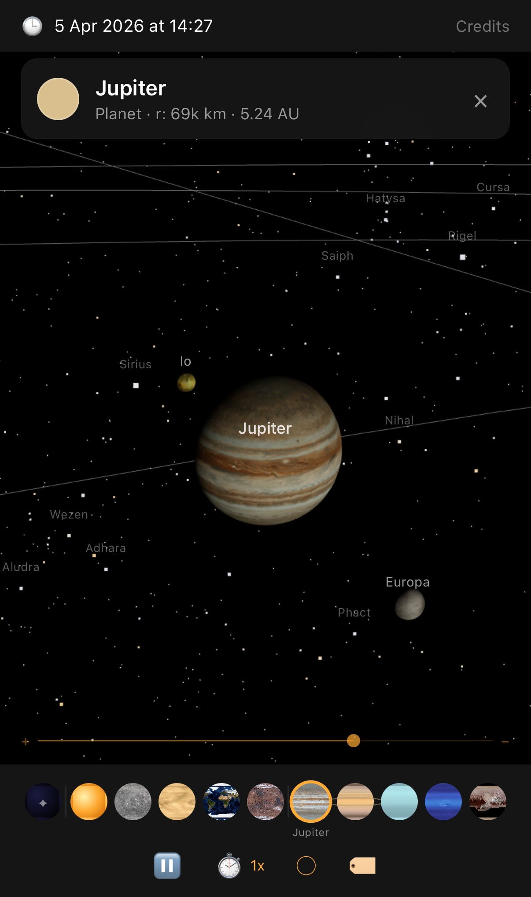

# SolarSystem Web

A real-time solar system simulation in your browser, powered by real orbital mechanics, NASA texture maps, and 8,920 real stars from the Hipparcos catalogue. Built with Three.js — zero dependencies beyond that.

You can run this for real [here](https://pcwilliams.design/solarsystem).



## Features

- **Accurate planetary positions** — Keplerian orbital elements from JPL calculate where every planet actually is right now
- **NASA texture maps** — All 9 planets, Earth's Moon, Jupiter's Galilean moons, and Pluto use real imagery from NASA, USGS, and Cassini
- **8,920 real stars** — Hipparcos catalogue with correct positions, magnitudes, and B-V colours. Recognisable constellations, Milky Way density
- **Realistic rotation** — Every body spins at its real IAU sidereal rate with correct axial tilt. Venus rotates backwards, Uranus rolls on its side
- **Tidally locked moons** — Earth's Moon, all Galilean moons, and Saturn's moons always show the correct face to their parent
- **Saturn's rings** — Custom geometry with Cassini colour and transparency maps, correctly tilted and non-rotating
- **Beautiful Sun** — Procedural granulation texture, limb darkening, 4-layer additive corona, 25-day rotation
- **Interactive exploration** — Drag to pan, right-drag to orbit, scroll to zoom. Touch-friendly on mobile
- **Planet strip** — Textured planet thumbnails in the toolbar — click any to fly there instantly
- **Time control** — Real-time through 1,000,000x speed, reverse, Reset to Now
- **Smart labels** — Separate toggles for planet, moon, and star labels. Auto-deconflicted, occluded behind planets
- **Credits panel** — Full source attribution for all textures, star data, and orbital data

## Requirements

Any modern browser with WebGL2 support:
- Chrome 89+
- Firefox 108+
- Safari 16.4+
- Edge 89+

Works on desktop (mouse) and mobile (touch). Adaptive layout adjusts for portrait and landscape orientations.

## Quick Start

```bash
cd solarsystem-web
./web-server.sh
```

Or manually: `python3 -m http.server 8080`

Open [http://localhost:8080](http://localhost:8080) in your browser.

A local HTTP server is required — opening `index.html` directly as a file won't work due to browser security restrictions on ES modules and texture loading.

## Controls

### Mouse (Desktop)

| Input | Action |
|-------|--------|
| Left-drag | Pan / translate the view |
| Right-drag | Orbit / rotate the viewing angle |
| Scroll wheel | Zoom in and out |
| Click body or label | Select and fly to that body |
| Double-click | Return to full solar system view |

### Touch (Mobile/Tablet)

| Input | Action |
|-------|--------|
| One-finger drag | Pan / translate the view |
| Two-finger drag | Orbit / rotate the viewing angle |
| Pinch | Zoom in and out |
| Tap body or label | Select and fly to that body |
| Double-tap | Return to full solar system view |

### Toolbar

- **Play/Pause** — Freeze or resume orbital motion
- **Speed menu** — 0.1x to 1,000,000x, reverse, Reset to Now
- **Orbit toggle** — Show/hide orbital path lines
- **Label menu** — Independent toggles for Planets, Moons, Stars
- **Planet strip** — Textured thumbnails for Sun, all planets, and overview
- **Credits** — Top-right button opens full source attribution panel

## How It Works

1. **Current time** is converted to Julian centuries from J2000.0 epoch
2. **Orbital elements** are computed for each body from JPL data with linear rates
3. **Kepler's equation** is solved iteratively (Newton-Raphson) to find each body's position
4. **Positions are scaled** logarithmically so the whole solar system fits on screen
5. **IAU rotation** is applied — axial tilt and spin angle from real sidereal periods
6. **Three.js renders** with PBR materials, NASA textures, and 60fps updates via WebGL
7. **8,920 stars** from the Hipparcos catalogue form the background with real positions and colours
8. **HTML/CSS overlays** provide labels, controls, and a zoom slider

## Tech Stack

- **Three.js** r170 — 3D rendering (loaded from CDN, no install needed)
- **Vanilla JavaScript** — ES modules, no framework
- **HTML/CSS** — UI overlays with glass-morphism

Zero npm dependencies. No build step. No bundler.

## Project Structure

```
solarsystem-web/
├── index.html               # Single-page app with all UI
├── web-server.sh            # Launch script for local server
├── js/
│   ├── main.js              # Entry point, animation loop, UI
│   ├── solarSystemData.js   # All celestial body data (JPL elements)
│   ├── orbitalMechanics.js  # Kepler solver, Julian dates, positions
│   ├── sceneBuilder.js      # Three.js scene construction
│   ├── textureGenerator.js  # Procedural Sun and glow textures
│   └── cameraController.js  # Orbital camera with mouse + touch
└── textures/                # NASA JPEGs, ring textures, star catalogue
```

## Documentation

- [CLAUDE.md](CLAUDE.md) — Developer reference and architecture
- [architecture.html](https://pcwilliams.design/dev/solarsystem-web/architecture.html) — Interactive diagrams
- [tutorial.html](https://pcwilliams.design/dev/solarsystem-web/tutorial.html) — Build narrative and development story

## Origin

Ported from the [iOS SolarSystem app](../solarsystem/) — same orbital mechanics, same NASA textures, same visual design. The web version runs identically in any browser without needing Xcode, an Apple device, or any installation.

## Credits and Licences

This project uses publicly available texture maps and star catalogue data for non-commercial, educational purposes.

### Textures

| Body | Source | Licence |
|------|--------|---------|
| Earth | NASA Blue Marble Next Generation (Dec 2004) | Public domain |
| Moon | NASA Lunar Reconnaissance Orbiter Camera | Public domain |
| Mars | USGS Viking MDIM21 mosaic, via Wikimedia | Public domain |
| Jupiter | NASA/JPL/SSI Cassini cylindrical map [PIA07782](https://photojournal.jpl.nasa.gov/catalog/PIA07782) | Public domain |
| Pluto | NASA/JHUAPL/SwRI New Horizons colour map | Public domain |
| Europa | NASA/JPL Voyager/Galileo mosaic, via Wikimedia | Public domain |
| Mercury | [Solar System Scope](https://www.solarsystemscope.com/textures/) | CC-BY 4.0 |
| Venus | [Solar System Scope](https://www.solarsystemscope.com/textures/) | CC-BY 4.0 |
| Uranus | [Solar System Scope](https://www.solarsystemscope.com/textures/) | CC-BY 4.0 |
| Neptune | [Solar System Scope](https://www.solarsystemscope.com/textures/) | CC-BY 4.0 |
| Saturn (body) | [Planet Pixel Emporium](http://planetpixelemporium.com/) by James Hastings-Trew | Free non-commercial |
| Saturn (rings) | [Planet Pixel Emporium](http://planetpixelemporium.com/) by James Hastings-Trew | Free non-commercial |
| Io | Assembled by [Steve Albers](http://stevealbers.net/) from NASA/JPL data | Public domain source data |
| Ganymede | Assembled by [Steve Albers](http://stevealbers.net/) from NASA/JPL data | Public domain source data |
| Callisto | Assembled by Bjorn Jonsson from NASA/JPL data | Public domain source data |

### Star Data

| Resource | Source | Licence |
|----------|--------|---------|
| HYG Star Database v38 | [astronexus/HYG-Database](https://github.com/astronexus/HYG-Database) by David Nash. Compiled from ESA Hipparcos, Yale Bright Star Catalogue, and Gliese Catalogue of Nearby Stars. | CC-BY-SA 2.0 |

### Orbital and Rotation Data

- **Planetary orbital elements** — JPL "Keplerian Elements for Approximate Positions of the Major Planets" (Standish, 1992)
- **IAU rotation models** — IAU Working Group on Cartographic Coordinates and Rotational Elements
